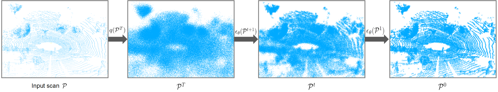

# PVNet: Point-Voxel Interaction LiDAR Scene Upsampling Via Diffusion Models

**[Paper](https://ieeexplore.ieee.org/document/11207156)**

We propose a diffusion model-based point-voxel interaction framework (PVNet) to perform LiDAR point cloud upsampling without dense supervision. Our methed achieves scene-level point cloud upsampling method with arbitrary upsampling rates.



## Preliminary

### Installation

1. Install PyTorch and Torchvision referring to https://pytorch.org/get-started/locally/. (python=3.9, pytorch=1.11.0)
2. The other dependencies' install refer to [LiDiff](https://github.com/PRBonn/LiDiff) 

### Dataset Preparation

#### 1. Download the Data

**SemanticKITTI:** The SemanticKITTI dataset has to be download from the official [site](http://www.semantic-kitti.org/dataset.html#download) and extracted in the following structure:

```
./pvnet/
└── Datasets/
    └── SemanticKITTI
        └── dataset
          └── sequences
            ├── 00/
            │   ├── velodyne/
            |   |       ├── 000000.bin
            |   |       ├── 000001.bin
            |   |       └── ...
            │   └── labels/
            |       ├── 000000.label
            |       ├── 000001.label
            |       └── ...
            └── 08/ # for validation:40, test: 200
```

### Synthetic point cloud  generation

To generate the sythetic point cloud, you can run the `map_from_scans.py` script. This will use the dataset scans and poses to generate the sequence map to be used as ground truth during training:

```
python3 map_from_scans.py --path Datasets/SemanticKITTI/dataset/sequences/
```
### Pretrained weights

The pretrained weight can be downloaded [here]() , and put the pretrained wieght into the folder in ckpt/checkpoints/.

## Usage

### 1. Training

For training the model, the configurations are defined in config/config.yaml, and the training can be started with:

python train.py

### 2. Testing

For testing the model, the testing can be started with:

python train.py -t

## Results

1. **SemanticKITTI**

    |                    Method                 | CD  |  RCD  | Recon-RCD  | Match-RCD | Times(s) |
    | :------------------------------------------: | :---: | :---: | :---: | :----: | :----: |
    | PVNet (X 4)     | 0.097   | 0.342 | 0.365 | 0.348 | 43.13 |
    | PVNet (X 16)    | 0.082   | 0.655 | 0.706 | 0.675 | 84.22 |

3. **KITTI-360**

    |                    Method                 | CD  |  RCD  | Recon-RCD  | Match-RCD | Times(s) |
    | :------------------------------------------: | :---: | :---: | :---: | :----: | :----: |
    | PVNet (X 4)     | 0.173   | 0.578 | 0.638 | 0.602 | 42.98 |
    | PVNet (X 16)    | 0.148   | 1.184 | 1.389 | 1.261 | 78.06 |
   
## Citation

If you find our paper and code useful for your research, please consider giving this repo a star :star: or citing :pencil::

```BibTeX
@article{cheng2025pvnet,
  title={Pvnet: Point-voxel interaction lidar scene upsampling via diffusion models},
  author={Cheng, Xianjing and Wu, Lintai and Wang, Zuowen and Hou, Junhui and Wen, Jie and Xu, Yong},
  journal={IEEE Transactions on Image Processing},
  year={2025},
  volume={34},
  number={},
  pages={6895-6910},
  publisher={IEEE}
}

